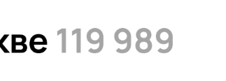

# Задание 1
Так как оригинальный сайт сейчас сильно отличается по дизайну от представленного в задании, то предполагаю, что смысл по большей части состоит в проверке результатов поиска по заданным фильтрам.

### Начальные условия:
Входим на сайт https://www.avito.ru/ в качестве гостя

### Шаги воспроизведения:
1. Нажать навигационную кнопку `Все категории`
2. Выбрать `Электроника` из списка
3. Выбрать `Мобильные телефоны` из категории `Телефоны`
4. В поле `Производитель` вписать и выбрать `Samsung`
5. В фильтре `Память` выбрать `512 ГБ`
6. В фильтре `Цвет` выбрать цвет `Синий`
7. В фильтре `Цена, ₽` в поле `до` ввести `50000`
8. Нажать кнопку `Показать n объявлений`

### Ожидаемое поведение:
Результаты поиска соответствуют заданным фильтрам. Сайт в целом отображает корректную информацию, нет орфографических ошибок, элементы интерфейса сайта никуда не съехали.

### Наблюдаемое поведение:
1. Ошибка в написании логотипа. **(high)**
   
   

2. Заявленная модель телефона не соответствует изображенной на объявлении. **(high)**
   

3. Объявление не соответствует выбранному производителю `Samsung`, цвет также не соответствует выбранному `синему`. **(medium)**
   

4. Объявление не соответствует выбранной памяти `512 ГБ` и выбранному `синему` цвету. Шрифт с названием модели телефона меньше, чем у остальных объявлений. **(medium)**
   

5. Объявление не соответствует выбранному `синему` цвету, а также цене `до 50000`. **(medium)**
   

6. Категории написаны со строчной буквы, также нет категории `Samsung` в списке и заголовке поиска. **(low)**
   
   

7. Количество найденных объявлений не соответствует с количеством объявлений в заголовке поиска. **(medium)**
   
   

8. Выбрано отображение `карта`, хотя отображение товаров на странице в виде `галереи`. **(high)**
   

9. Не указано время, сколько идти от метро `Тульская` и `Савёловская` до адреса. **(medium)**
   

10. Метро `Соколдо` не существует. **(high)**
   

11.  Нет навигационного бара в верхней части сайта для входа в профиль, регистрации и так далее. **(critical)**